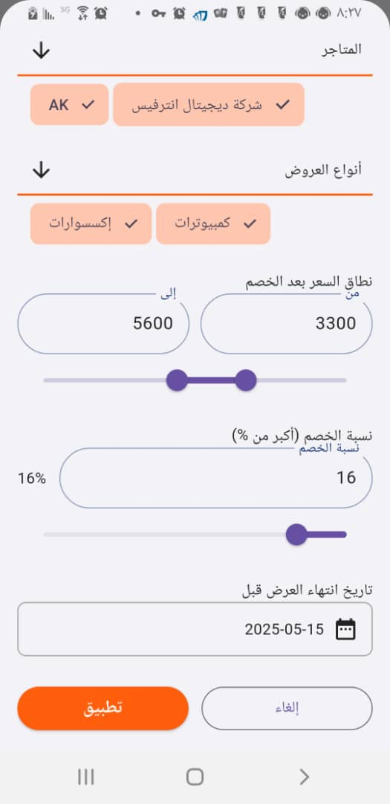
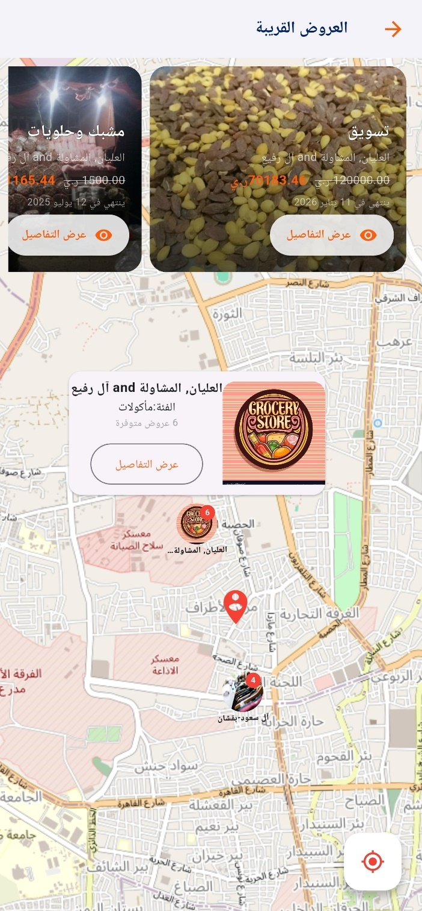
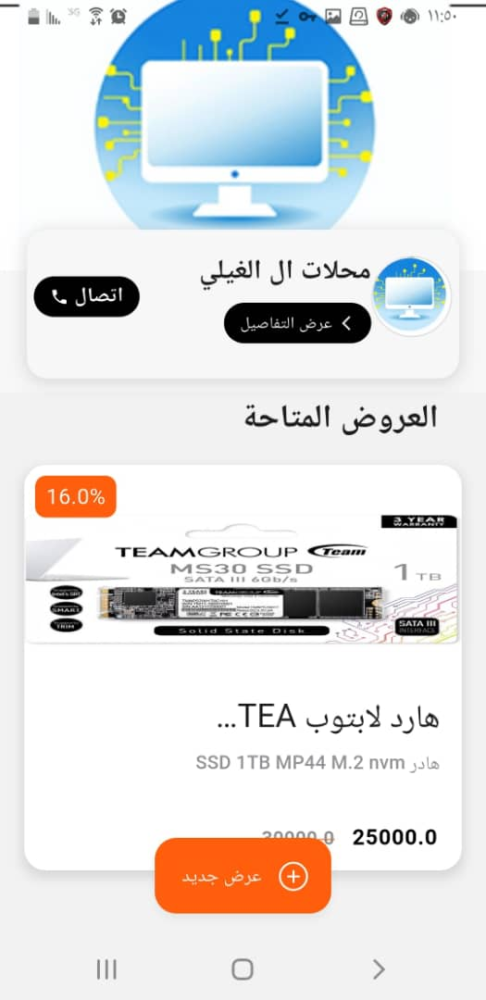
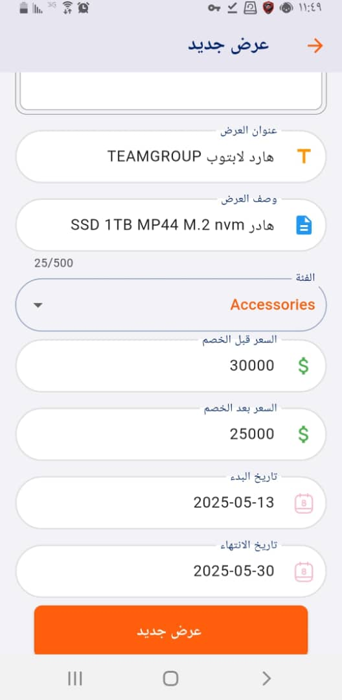
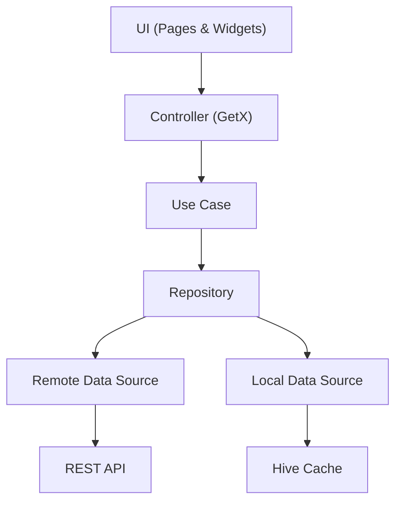

<div align="center">


# Yemen Offers

**A Flutter marketplace app connecting consumers with deals and offers across Yemen.**


[Getting Started](#-getting-started) • [Architecture](#%EF%B8%8F-architecture) • [Features](#-features-overview) • [Screenshots](#-screenshots)

</div>

---

## Demo Preview

<div align="center">


</div>

---

## Highlights

- **Feature-first Clean Architecture** — Self-contained feature modules with `data/domain/presentation` layers
- **GetX** — Reactive state management, dependency injection, and named routing
- **JWT Authentication** — Email/password login, Google OAuth via browser redirect, OTP verification, password reset via deep links
- **Dual-role Platform** — Separate consumer and merchant flows
- **Smart Search** — Vector keyword search and image-based offer search
- **Interactive Maps** — Google Maps and OpenStreetMap with store markers and popups
- **Bilingual (AR/EN)** — Arabic and English with RTL support and language switching
- **Push Notifications** — Firebase Cloud Messaging with rich image notifications

---

## Screenshots

### Home & Browse

| | | |
|:---:|:---:|:---:|
|  |  |  |
|  |  |  |

### Merchant

| | | |
|:---:|:---:|:---:|
|  |  |  |

---

## Architecture

This project follows **Clean Architecture** with a **feature-first** organization. Each feature is self-contained with its own `data`, `domain`, and `presentation` layers.

### Layer Flow



### Layer Responsibilities

| Layer | Location | Responsibility |
|-------|----------|----------------|
| **UI** | `presentation/views/pages/` + `widgets/` | Screens, reusable widgets, layout. No business logic. |
| **Controller** | `presentation/getX/controllers/` | Manages UI state (`Rx` types), calls use cases, handles user actions. |
| **Binding** | `presentation/getX/*_binding.dart` | Registers all dependencies for a route via GetX DI. |
| **Use Case** | `domain/use_cases/` | Single-purpose class. One method. Encapsulates business logic. |
| **Repository** | `domain/repos/` (abstract) / `data/repos/` (impl) | Defines contract (domain) and implements it (data). |
| **Data Source** | `data/sources/` | Makes HTTP calls via `ApiService`. Handles response parsing. |
| **Model** | `data/models/` | JSON serialization (`fromJson`/`toJson`). Maps to entities. |
| **Entity** | `domain/entities/` | Pure business objects. No framework dependencies. |

---

## Project Structure

```
lib/
├── main.dart                              # App entry, Hive init, runApp
├── app_home.dart                          # GetMaterialApp + deep link listener
│
├── core/                                  # Shared infrastructure
│   ├── binding/                           # Global DI (AppBinding)
│   ├── cache/                             # Hive box wrapper (CacheHelper)
│   ├── common/
│   │   ├── controllers/                   # Shared controllers (e.g. filters)
│   │   ├── presentation/
│   │   │   ├── layout/                    # Reusable layout wrappers
│   │   │   ├── no_internet_page.dart      # No internet screen
│   │   │   └── widgets/                   # 23 shared widgets
│   │   └── services/                      # Network monitoring service
│   ├── constants/                         # API endpoints, cache keys, enums, assets
│   ├── errors/                            # Failure hierarchy, Dio exception mapping
│   ├── middlewares/                        # Route middlewares (onboarding guard)
│   ├── network/                           # Dio config, ApiService, connectivity
│   ├── routes/                            # Named routes + page definitions
│   ├── services/                          # Location, theme, FCM, language, notifications
│   ├── theme/                             # Colors, text styles, spacing, ThemeData
│   └── utils/                             # Validators, date utils, map utils, URL utils
│
└── features/                              # Feature modules (self-contained)
    ├── auth/                              # Login, register, OTP, password reset, Google OAuth
    ├── home/                              # Home feed, carousel, bottom nav, main scaffold
    ├── browse/                            # Category browsing, offer/store lists, nearby maps
    ├── search/                            # Keyword search, image search
    ├── favorite/                          # Save/remove favorites, share offers
    ├── offer/                             # Merchant offer CRUD
    ├── store/                             # Merchant store CRUD
    ├── profile/                           # User & merchant profile, settings
    ├── notification/                      # Push notification list
    └── onboarding/                        # Splash, onboarding walkthrough
```

---

## Getting Started

### Prerequisites

- **Flutter SDK** — `>=3.7.0`
- **Dart SDK** — `>=3.7.0`
- **IDE** — VS Code / Android Studio with Flutter extensions
- **Backend** — REST API running at configured base URL

### Installation

```bash
git clone https://github.com/your-username/YO-flutter.git
cd YO-flutter
flutter pub get
```

### Run

```bash
flutter run
```

### Build

```bash
flutter build apk --release
```

---

## Configuration

### API Base URL

Update `lib/core/constants/api_constants.dart` to point to your backend:

```dart
static const String domain = "http://YOUR_SERVER_IP";
static const String baseUrl = "$domain/api/";
```

### Firebase

Firebase is configured via `lib/core/services/firebase/firebase_options.dart` (generated by FlutterFire CLI). Push notifications use Firebase Cloud Messaging.

### Google Maps

Google Maps requires an API key configured in:
- **Android:** `android/app/src/main/AndroidManifest.xml`
- **iOS:** `ios/Runner/AppDelegate.swift`

---

## Tech Stack

### Core

| Package | Purpose |
|---------|---------|
| [get](https://pub.dev/packages/get) `^4.7.2` | State management, DI, and routing |
| [dio](https://pub.dev/packages/dio) `^5.8.0+1` | HTTP client with JWT interceptors |
| [hive](https://pub.dev/packages/hive) `^2.2.3` | Local key-value storage |
| [dartz](https://pub.dev/packages/dartz) `^0.10.1` | Functional error handling (`Either<Failure, T>`) |

### Location & Maps

| Package | Purpose |
|---------|---------|
| [geolocator](https://pub.dev/packages/geolocator) `^13.0.3` | GPS location services |
| [google_maps_flutter](https://pub.dev/packages/google_maps_flutter) `^2.11.0` | Google Maps widget |
| [flutter_map](https://pub.dev/packages/flutter_map) `^8.1.1` | OpenStreetMap widget |
| [geocoding](https://pub.dev/packages/geocoding) `^3.0.0` | Address ↔ coordinate conversion |

### Firebase & Notifications

| Package | Purpose |
|---------|---------|
| [firebase_core](https://pub.dev/packages/firebase_core) `^3.13.0` | Firebase initialization |
| [firebase_messaging](https://pub.dev/packages/firebase_messaging) `^15.2.5` | Push notifications via FCM |
| [flutter_local_notifications](https://pub.dev/packages/flutter_local_notifications) `^19.1.0` | Local notification display |

### UI & Media

| Package | Purpose |
|---------|---------|
| [cached_network_image](https://pub.dev/packages/cached_network_image) `^3.4.1` | Disk-cached network images |
| [image_picker](https://pub.dev/packages/image_picker) `^1.1.2` | Camera/gallery image selection |
| [carousel_slider](https://pub.dev/packages/carousel_slider) `^5.0.0` | Image carousel |
| [shimmer](https://pub.dev/packages/shimmer) `^3.0.0` | Shimmer loading skeletons |
| [lottie](https://pub.dev/packages/lottie) `^3.3.1` | Lottie animations |

### Navigation & Links

| Package | Purpose |
|---------|---------|
| [app_links](https://pub.dev/packages/app_links) `^6.4.0` | Deep linking for password reset and OAuth callbacks |
| [url_launcher](https://pub.dev/packages/url_launcher) `^6.3.1` | Open external URLs, maps, phone dialer |
| [share_plus](https://pub.dev/packages/share_plus) `^11.0.0` | Share offer content to other apps |

### Connectivity

| Package | Purpose |
|---------|---------|
| [internet_connection_checker_plus](https://pub.dev/packages/internet_connection_checker_plus) `^2.7.1` | Internet access verification |
| [connectivity_plus](https://pub.dev/packages/connectivity_plus) `^6.1.3` | Network type detection |

---

## Features Overview

### Consumer Features

| Feature | Description |
|---------|-------------|
| **Home Feed** | Image carousel, categories grid, most popular offers, latest offers, scrollable store list |
| **Browse** | Category browsing, filterable offer/store lists, offer details with pricing and map, store details with contact info and social links |
| **Nearby** | Map-based view of nearby offers and stores with marker popups |
| **Search** | Vector keyword search and image-based visual search |
| **Favorites** | Save/remove favorites, dedicated favorites page, share offers |

### Merchant Features

| Feature | Description |
|---------|-------------|
| **Store Management** | Create, edit, and manage stores with name, description, address, category, map location, and social links |
| **Offer Management** | Create, edit, and manage offers with title, description, pricing, discount, date range, image, and categories |
| **Offer Analytics** | View offer performance (views, clicks, shares, favorites) |

### Shared Features

| Feature | Description |
|---------|-------------|
| **Authentication** | Email/password login, Google OAuth via browser redirect, registration with OTP verification, password reset via deep links, join as merchant |
| **Profile** | View/update profile, change password, merchant profile |
| **Theme** | Full light/dark theme with persistence via Hive |
| **Language** | Arabic and English with RTL support and language switching |
| **Notifications** | Push notifications via FCM with rich image support |
| **Onboarding** | Animated splash screen, 3-page onboarding walkthrough on first launch |

---

## Theme System

- **Material 3** with full light and dark `ThemeData` configurations
- **Dark Mode** — Persisted via Hive, toggled from profile page
- **Typography** — Centralized text styles in `lib/core/theme/text_styles.dart`
- **Spacing System** — `small` (8px), `medium` (16px), `large` (24px) in `lib/core/theme/spacing.dart`

---

## State Management

The app uses **GetX** for reactive state management:

- **Reactive State** — `Rx` types (`RxList`, `RxBool`, etc.) with `Obx` widget bindings
- **Controller Lifecycle** — Controllers extend `GetxController`, state managed via `Rx` types
- **Bindings** — Each route has a binding class registering controllers and repositories via GetX DI
- **Navigation** — Named routes with `Get.toNamed()`, `Get.offAllNamed()`, `Get.back()`

---

## Dependency Injection

### Global Singletons

Registered in `AppBinding` (applied to `GetMaterialApp`):

| Service | Scope |
|---------|-------|
| `ApiService` | `permanent: true` |
| `ThemeService` | `permanent: true` |
| `LocationService` | `permanent: true` |
| `NetworkService` | `permanent: true` |

### Feature-level DI

Each feature binding registers its own controllers and repositories using `Get.lazyPut()` with `fenix: true` for re-creation on route revisit.

---

## Networking

- **Base URL:** Configured in `lib/core/constants/api_constants.dart`
- **Timeouts:** 5000ms connect, 5000ms receive
- **Auth Interceptor:** Automatically attaches `Bearer <token>` to every request

### API Modules

| Module | Endpoints |
|--------|-----------|
| **Auth** | Login, register, OTP, password reset, Google OAuth, logout |
| **Profile** | User/merchant profile, password change |
| **Stores** | CRUD for merchant stores |
| **Offers** | CRUD for merchant offers |
| **Browse** | Categories, offer categories, stores, offers, nearby, latest, popular |
| **Search** | Vector text search, image search |
| **Favorites** | Save/remove/list favorites |
| **Recommendations** | Behavior-based offer recommendations |
| **Notifications** | FCM token management, notification list |

---

## Error Handling

Functional error handling with `dartz`:

- **Failure Hierarchy** — `ServerFailure`, `CacheFailure`, `NetworkFailure` extending abstract `Failure`
- **Dio Error Mapping** — Every `DioExceptionType` mapped to user-facing messages
- **Flow** — DataSource throws → Repository catches → returns `Left(Failure)` → Controller calls `.fold()` → shows snackbar on failure

---

## Caching

Single Hive box (`APP_CACHE`) stores:

| Key | Purpose |
|-----|---------|
| `ACCESS_TOKEN` | JWT access token |
| `REFRESH_TOKEN` | JWT refresh token |
| `IS_FIRST_OPEN` | First launch detection (onboarding gate) |
| `IS_DARK_MODE` | Theme preference |
| `APP_LANG` | Selected language |
| `EMAIL_NOT_CONFIRMED` | Email confirmation state |

---

## User Experience

- **Shimmer Skeletons** — Loading placeholders for all major content lists
- **Circular Progress Indicators** — Page-level loading for detail screens
- **Form Validation** — 16 validators covering email, password, phone (Yemeni prefixes), URLs, social media links, lat/long, addresses — all localized in Arabic and English
- **Empty States** — No internet page with illustration and retry, empty category/offer lists
- **Smooth Navigation** — Named route navigation with GetX, route middlewares for onboarding flow, deep link handling for external entry points

---

## Engineering Highlights

| Practice | Implementation |
|----------|----------------|
| **Clean Architecture** | Three-layer separation (presentation/domain/data) per feature |
| **Feature-first Organization** | Each feature is self-contained with its own layers |
| **Repository Pattern** | Abstract interfaces in domain, implementations in data |
| **Dependency Injection** | GetX bindings with singleton and lazy registration |
| **Functional Error Handling** | `Either<Failure, T>` with typed failure hierarchy |
| **Reactive State Management** | GetX `.obs` types with `Obx` widget bindings |
| **Centralized Constants** | API endpoints, cache keys, assets, enums in dedicated files |
| **Reusable Widgets** | 23 shared widgets in `core/common/presentation/widgets/` |
| **Interceptor-based Auth** | Automatic JWT token attachment via Dio interceptor |
| **Persistent Preferences** | Theme, language, and auth state persisted via Hive |
| **Localization** | Full Arabic/English support with RTL awareness |
| **Modular Services** | Location, theme, network, notifications as independent services |

---

## Testing

```bash
flutter test
flutter test --coverage
```

> **Note:** No automated tests are currently implemented. Contributions welcome.

---

## Project Metrics

| Metric | Count |
|--------|-------|
| Feature Modules | 10 |
| Screens | 30 |
| Controllers | 30 |
| Shared Widgets | 23 |
| Translation Keys | 186 |
| Validators | 16 |
| Services | 6 |
| Map Providers | 2 (Google Maps, OpenStreetMap) |
| Supported Languages | 2 (Arabic, English) |

---

## Contributing

Contributions are welcome! Please follow these steps:

1. **Fork** the repository
2. **Create** a feature branch (`git checkout -b feature/amazing-feature`)
3. **Commit** your changes (`git commit -m 'feat: add amazing feature'`)
4. **Push** to the branch (`git push origin feature/amazing-feature`)
5. **Open** a Pull Request

### Commit Convention

This project follows [Conventional Commits](https://www.conventionalcommits.org/):

```
feat:     new feature
fix:      bug fix
docs:     documentation changes
style:    formatting, missing semicolons, etc.
refactor: code refactoring
test:     adding tests
chore:    maintenance tasks
```

---

## License

This project is licensed under the MIT License.

---

<div align="center">

**Built with ❤️ for Yemen**

[](https://flutter.dev)
[](https://dart.dev)

</div>
